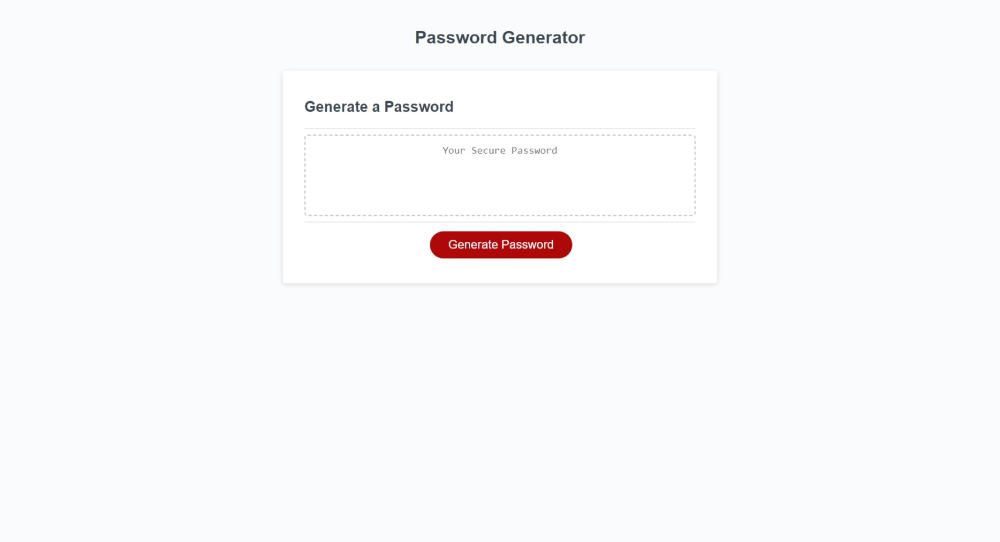
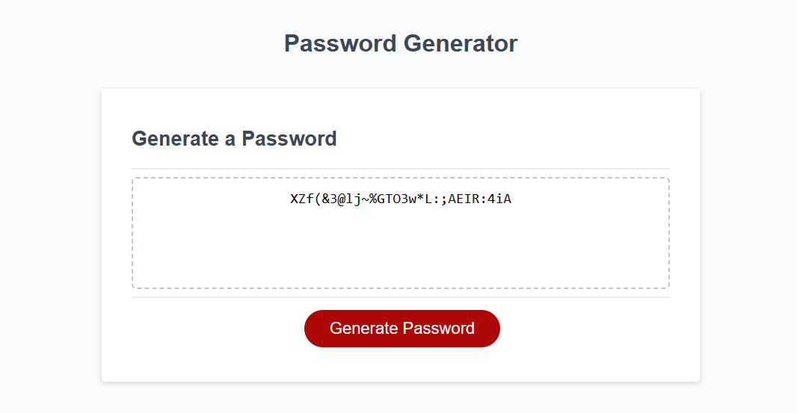
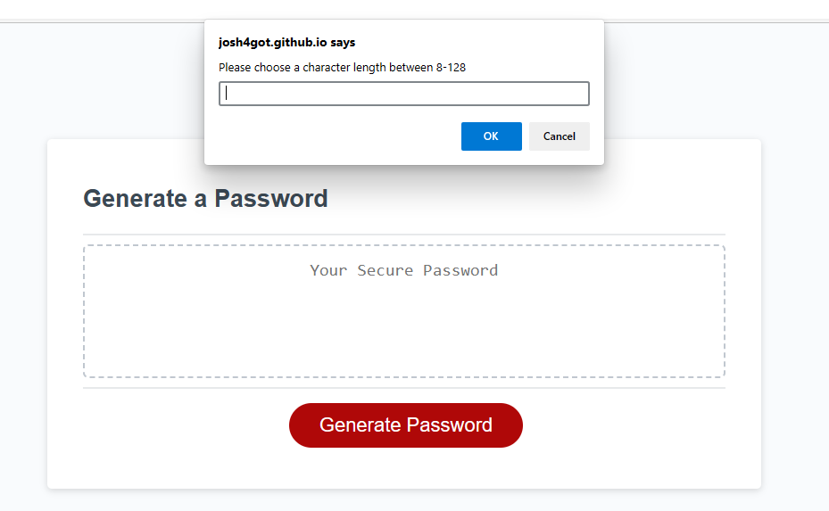
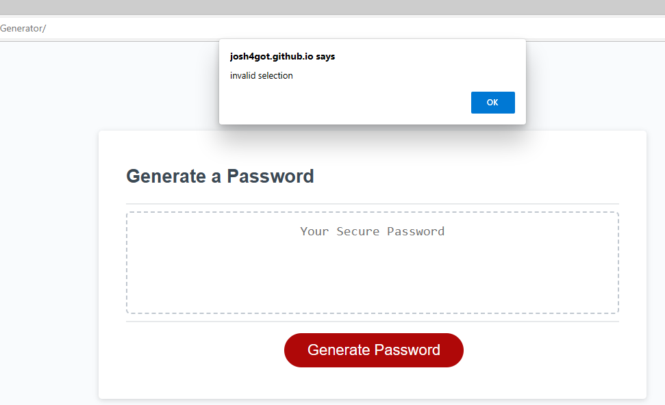

# Password-Generator

## Description

This web application can generate a random string of characters based on selected criteria. This string of characters can then be used as a password or username. This project shows my grasp on a number of javascript concepts such as: iteration, functions, arrays, variables, and strings.

## Installation

[DeployedWebpage](https://josh4got.github.io/Password-Generator/)

## Usage

To use this web application a user can click to gerate a password.

When clicked the user will be prompted for a password length between 8-128 characters. They will then be asked if which character types they would like to include.

The web application will validate the length and selected characters. The webpage then displays your generated password in the window.

## Credits

[Professional Readme Guide](https://coding-boot-camp.github.io/full-stack/github/professional-readme-guide)

[Array Methods](https://www.w3schools.com/js/js_array_methods.asp)

[Functions](https://www.w3schools.com/js/js_functions.asp)

[JS Random](https://www.w3schools.com/js/js_random.asp)

## License

Please see LICENSE in the repo.
